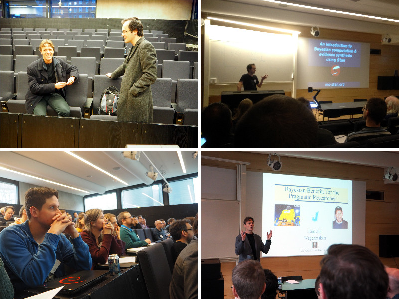
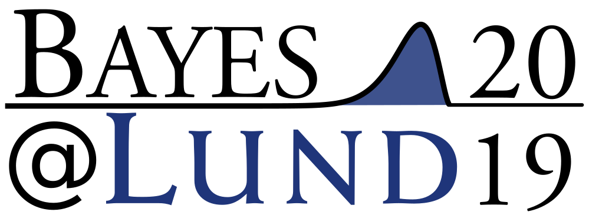
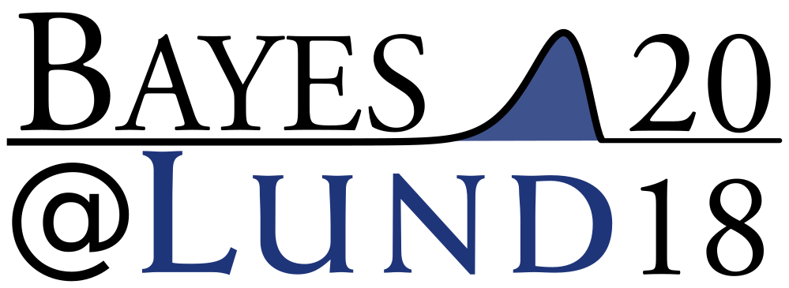
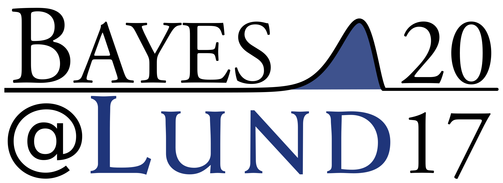
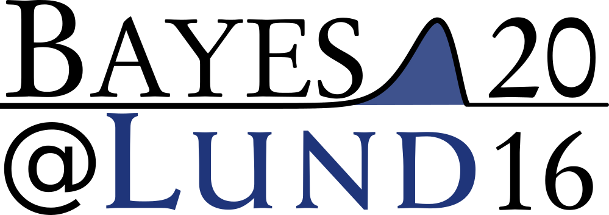
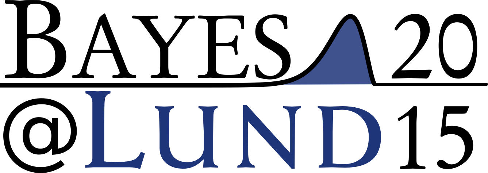
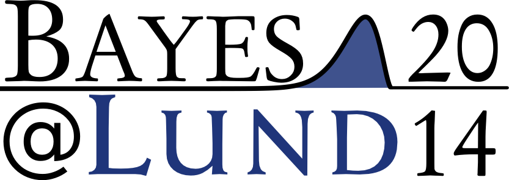

```{r setup, include=FALSE}
knitr::opts_chunk$set(echo = TRUE)
```

Welcome! On this page you will find information regarding the Bayes\@Lund series of mini-conferences.

What is a Bayes\@Lund mini-conference?
----------------------------------

A Bayes\@Lund mini-conference is a (more or less) local one day event bring together people working with or interested in Bayesian methods. Bayes@ events aims at being accessible to people with little experience of Bayesian methods while still being relevant to experienced practitioners. The focus is on how Bayesian methods are used in research and industry, what the advantages and challenges are with using Bayesian methods, and how Bayesian methods can be used and taught in a better way.


The first Bayes@ event was organized in Lund, Sweden by Rasmus Bååth and Ullrika Sahlin in 2014 when they noticed that, while many people use Bayesian methods at the university, they were spread all over campus. Rasmus and Ullrika thought: Why not meet up and share experiences and tips in a one day mini-conference? And so they did.

<center>
 <br>
*Photos from Bayes\@Lund 2016 including the invited speakers Eric-jan Wagenmakers (left) and Robert Grant (right).*
</center>

Past Bayes@ conferences
-----------------

### Bayes\@Lund 2019

[](lund2019/index.html)

*7th of May 2019, Lund University, Sweden.*

Main Organizers: Rasmus Bååth, Alexander Holmes, and Ullrika Sahlin<br>
Invited speakers: Maggie Lieu and Robert Grant

[Webpage](lund2019/index.html)

### Bayes\@Lund 2018

[](lund2018/bayes_at_lund_2018.html)

*12th of April 2018, Lund University, Sweden.*

Main Organizers: Ullrika Sahlin and Rasmus Bååth <br>
Invited speakers: Paul-Christian Bürkner and Ranta Jukka 

[Webpage (including slides and videos)](lund2018/bayes_at_lund_2018.html)

### Bayes\@Lund 2017



*20th April 2017, Lund University, Sweden*

Main Organizers: Umberto Picchini and Ullrika Sahlin <br>
Invited speakers: Richard McElreath and Darren Wilkinson

[Webpage](lund2017/www.maths.lu.se/bayeslund2017/index.html), 
[Book of abstracts](lund2017/bayes_at_lund_2017_program.pdf), 
[Presentation slides](lund2017/bayeslund17-pdf-slides.zip)


### Bayes\@Lund 2016




*5th February 2016, Lund University, Sweden*

Main Organizers: Rasmus Bååth and Ullrika Sahlin <br>
Invited speakers: Eric-Jan Wagenmakers and Robert Grant

[Webpage](lund2016/bayes_at_lund_2016.html), 
[Program and abstracts](lund2016/bayes_at_lund_2016_program.pdf),
[Poster](lund2016/bayes_at_lund_2016_poster.pdf)

### Bayes\@Lund 2015



*10th February 2015, Lund University, Sweden*

Main Organizers: Ullrika Sahlin, Rasmus Bååth, Krzysztof Podgorski, and Paul Caplat <br>
Invited speakers: Mattias Villani

[Webpage](lund2015/www.lucs.lu.se/bayes-at-lund-2015/index.html), 
[Program and abstracts](lund2015/bayes_at_lund_2015_program.pdf), 
[Poster](lund2015/bayes_at_lund_2015_poster.pdf)

### Bayes\@Lund 2014




*10th April 2014, Lund University, Sweden*

Main Organizers: Rasmus Bååth and Ullrika Sahlin

[Webpage](lund2014/www.lucs.lu.se/bayes-at-lund-2014/index.html), 
[Program and abstracts](lund2014/BayesAtLund2014Program.pdf), 
[Summary of the conference](lund2014/summaryBayesatLund2014.pdf), 
[Poster](lund2014/Bayes_at_Lund_2014.pdf)