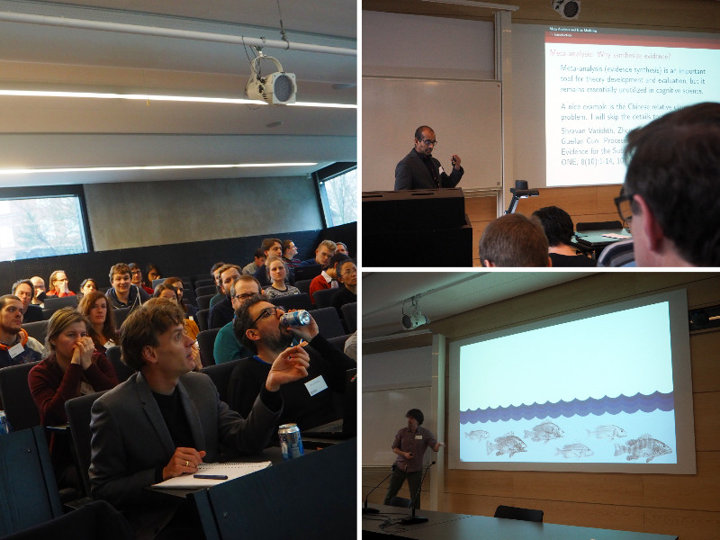

  
  <h2> 5th of February, 2016, Lund University</h2>

Bayes&#64;Lund 2016 Wrap-up
------------------------

Bayes&#64;Lund 2016 is over and we the organizers would like to thank both speakers and participants for making Bayes&#64;Lund 2016 a success! Below you'll find slides from the presentations and some photos from the event. If you want to get notified of other events at Lund University that relates to Bayesian methods consider subscribing to the Bayes&#64;Lund mailing list at http://www.lucs.lu.se/bayes/ .

All best,  
<i>Rasmus Bååth & Ullrika Sahlin</i>

### Presentation Slides ###

---------------------------------------------------

- **_An Introduction to Bayesian computation and evidence synthesis using STAN_, [Robert Grant](http://www.robertgrantstats.co.uk/), Faculty of Health, Social Care and Education, University of London.** [slides](slides/StanEvidenceSynth-Lund-5Feb2016.pdf), [demo code](http://www.robertgrantstats.co.uk/demo.R)
   
- **_Bayesian Benefits for the Pragmatic Researcher_, [Eric-Jan Wagenmakers](http://www.ejwagenmakers.com/), Department of Psychology, University of Amsterdam.** [slides](slides/EJ_PragmaticAdvantages2.ppt)
               
- **_Bayesian Meta Analysis and Bias Modeling: A Case Study with Relative Clause Processing in Mandarin Chinese_, [Shravan Vasishth](http://www.ling.uni-potsdam.de/~vasishth/) and Lena Jaeger, Departement of Linguistics, University of Potsdam.** [slides](slides/ShravanVasishth2016.pdf), [blog post](http://vasishth-statistics.blogspot.de/2016/01/my-msc-thesis-meta-analysis-of-relative.html)

- **_A Bayesian reflection on the meaning of evidence_, [Ullrika Sahlin](http://evidence.blogg.lu.se/),  Centre for Environmental and Climate Research, Lund University.** [slides](slides/Sahlin_bayesatlund2016.pdf)

- **_The Bootstrap is a Bayesian procedure, but that doesn't mean it's any good_, [Rasmus Bååth](http://www.sumsar.net), Lund University Cognitive Science.** [slides](https://docs.google.com/presentation/d/1r9PTXbspNl_duSUJMIDegpNEt62KAZLCuho3mFe1a40/edit?usp=sharing), [blog post](http://sumsar.net/blog/2015/04/the-non-parametric-bootstrap-as-a-bayesian-model/)
 
- **_Bayesian methods in epidemiological research – why so seldom used?_ [Jonas Björk](http://www.med.lu.se/labmedlund/amm/kontakt/jonas_bjoerk),  Division of occupational and environmental medicine, Lund University.** [slides](slides/Bayesian_methods_in_epidemiological_research.pptx)

- **_Modeling the growth of Swedish Scots pines_, [Henrike Häbel](https://www.chalmers.se/en/staff/Pages/henrike-habel.aspx), Department of Mathematical Sciences, Chalmers University of Technology.** [slides](slides/pres_Henrike_lund.pdf)
            
--------------------------------------------------

### Photos from the event ###

 

<i><h4>Below is the original Bayes&#64;Lund 2016 conference site.</h4></i>

 

Researchers and students are welcome to participate in the third edition of Bayes&#64;Lund! The purpose of this conference is to bring together researchers working with or interested in Bayesian methods. Bayes&#64;Lund aims at being **accesible** to researchers with little experience of Bayesian methods while still being **relevant** to experienced practitioners. The focus is on how Bayesian methods are used in research, what advantages Bayesian methods have over classical alternatives, and how the use and teaching of Bayesian methods can be encouraged. 

The conference will include a number of short contributed talks, an invited presentation by [Robert Grant](http://www.robertgrantstats.co.uk/) and a Keynote presentation by [Eric-Jan Wagenmakers](http://www.ejwagenmakers.com/). The day before the conference Eric-Jan Wagenmakers will also hold a tutorial seminar on Bayesian inference. More information about this event [here](#pre-conference-tutorial-on-bayesian-inference).

#### Keynote speaker: Eric-Jan Wagenmakers

This year we are happy to announce that the keynote speaker is Eric-Jan Wagenmakers,  professor in the Psychological Methods unit at the University of Amsterdam. He is a passionate advocate of Bayesian statistics and has published the textbook [*Bayesian Cognitive Modeling: A Practical Course*](http://bayesmodels.com/) and [numerous papers](http://scholar.google.com/citations?user=L_HG640AAAAJ&hl=en) on the subject. He is currently the supervisor of [JASP](https://jasp-stats.org/), an open source program with the aim of making Bayesian statistics accessible to the masses. His keynote presentation is titled ***Bayesian Benefits for the Pragmatic Researcher*** touching upon the concrete ways in which Bayesian inference can improve the scientific process.

Call for Presentations
------------------------

To contribute a presentation for Bayes&#64;Lund please send in the title of your talk with an abstract (not more than 100 words) to rasmus.baath@lucs.lu.se. Final date for presentations submission is the 20th of December. Any topic related to Bayesian methods is relevant including, but not restricted to:

* **Case studies**. Have you used Bayesian methods in your research? Describe what you did, and how it worked out.
* **Tutorial style talks**. Want to share your favourite tool or modeling technique? This does not have to be novel research, just a useful tool *for* research!
* **Method development**. Are you developing novel Bayesian methods that you want to share?
* **Teaching Bayes**. Do you have experiences teaching Bayesian methods. What was the challenges, and do you have any useful tips?

Each accepted speaker is given 20 minutes and, as the audience will be highly heterogeneous, the talk is expected to be accessible and engaging for a multidisciplinary audience. 

Conference registration
-----------------------

Bayes&#64;Lund is free to attend, but as the space is limited we ask you to register your attendance here. The final date of registration is __29th of January__.

<b>The conference is now unfortunately full and the registration is closed.</b>

<!--

<iframe src="https://docs.google.com/forms/d/1zyRD6ph9uXWGMnmAjETopniEZHwfJ-Q2K_2-ACBBMEY/viewform?embedded=true" width="760" height="500" frameborder="0" marginheight="0" marginwidth="0">Loading...</iframe>

-->

Important Dates
---------------
<!--
* Final date for presentations submission: __20th of December__
* Notifications to presenters: __24th of December__
* Final date for registration: __29th of January__
-->
* Tutorial seminar on Bayesian inference with E.J. Wagenmakers: __4th of February__
* The conference: __5th of February__

Location
---------------

Room LUX:C121 in the Lux building,  Helgonavägen 3, Lund University. How to find it: http://www.ht.lu.se/en/lux/kontakt/kartor-och-fardsatt/

Program
-------------

For the full program, including abstracts, see [the program booklet](http://www.lucs.lu.se/wp-content/uploads/2016/01/bayes_at_lund_2016_program.pdf).

-----------------------------------------------------------------
  &nbsp;      &nbsp;
  
------------- --------------------------------------------------
 11.45        Registration opens (just outside room LUX:C121)
 
 12.15-12.45  Welcome and invited presentation  
              - **_An Introduction to Bayesian computation and evidence synthesis using STAN_, [Robert Grant](http://www.robertgrantstats.co.uk/), Faculty of Health, Social Care and Education, University of London.** 
   
 12.45-13.15  Sandwich lunch and mingle in the foyer (free, but requires registration)
              
 13.15-14.15  Keynote presentation 
              - **_Bayesian Benefits for the Pragmatic Researcher_, [Eric-Jan Wagenmakers](http://www.ejwagenmakers.com/), Department of Psychology, University of Amsterdam.**
               
 14.20-15.10  Session 1  
              - **_Bayesian Meta Analysis and Bias Modeling: A Case Study with Relative Clause Processing in Mandarin Chinese_, [Shravan Vasishth](http://www.ling.uni-potsdam.de/~vasishth/) and Lena Jaeger, Departement of Linguistics, University of Potsdam.**   
              - **_A Bayesian reflection on the meaning of evidence_, [Ullrika Sahlin](http://evidence.blogg.lu.se/),  Centre for Environmental and Climate Research, Lund University.**  
              - **_The Bootstrap is a Bayesian procedure, but that doesn't mean it's any good_, [Rasmus Bååth](http://www.sumsar.net), Lund University Cognitive Science.**
 
 15.10-15.30  Coffee and cake

 15.30-16.30  Session 2  
              - **_Bayesian methods in epidemiological research – why so seldom used?_ [Jonas Björk](http://www.med.lu.se/labmedlund/amm/kontakt/jonas_bjoerk),  Division of occupational and environmental medicine, Lund University.** 
              - **_Regularized supervised topic models for high-dimensional multi-class regression_, [Måns Magnusson](https://twitter.com/MansMeg),  Department of Computer and Information Science, Linköping University.** 
              - **_Modeling the growth of Swedish Scots pines_, [Henrike Häbel](https://www.chalmers.se/en/staff/Pages/henrike-habel.aspx), Department of Mathematical Sciences, Chalmers University of Technology.**
              
 16.30          Concluding remarks and end of conference.
                   
------------- --------------------------------------------------

Pre-conference tutorial on Bayesian inference
-------------------------

The day before the conference there will be a tutorial seminar on Bayesian inference by Eric-Jan Wagenmakers, a great opportunity to learn or brush up the basics of Bayes! 

**Date?** Thursday 4th of February, 2016.

**Time?** 13:30 - 16:00, including break.

**Where?** Room B152 in the Lux building, Lund University. How to find it: http://www.ht.lu.se/en/lux/kontakt/kartor-och-fardsatt/

**What?** In the first part of the seminar, the principles of Bayesian parameter estimation and hypothesis testing will be illustrated with a concrete example. The second part of the seminar features a brief tour of [JASP](https://jasp-stats.org/), a software program that showcases the practical feasibility of the Bayesian agenda.

**How?** To sign up for the tutorial please use [the Conference registration form above](#conference-registration). Note that the number of spaces available on the tutorial is limited. 

Contact
--------------
For more info, contact:

* *Rasmus Bååth*, Lund University Cognitive Science, Department of Philosophy: rasmus.baath [at] lucs.lu.se
* *Ullrika Sahlin*, Lund University Centre of Environmental and Climate Research: ullrika.sahlin [at] cec.lu.se

If you want to get notified of other events at Lund University that relates to Bayesian methods consider subscribing to the Bayes&#64;Lund mailing list at http://www.lucs.lu.se/bayes/ .

Acknowledgement
----------------

The conference was arranged as part of the [advanced study group Quantifying and Communicating Uncertainty](http://www.maths.lth.se/matstat/staff/umberto/bayes-asg.html) at the [Pufendorf institute](http://www.pi.lu.se/). We are deeply grateful to the [Pufendorf Institute](http://www.pi.lu.se/) for financial support of this event!