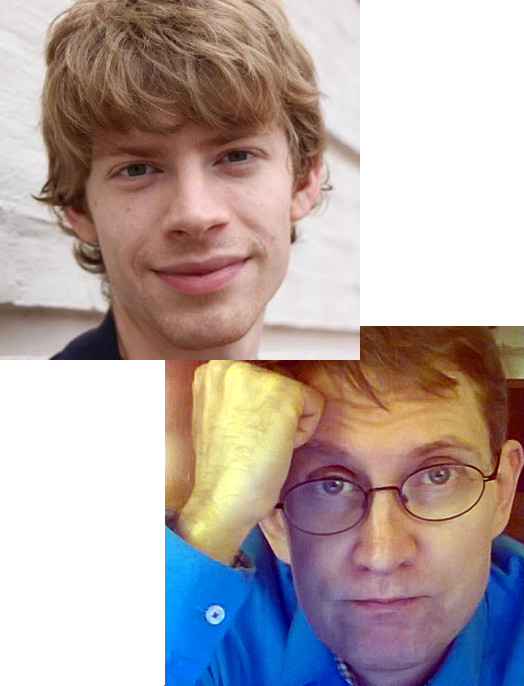

  
  <h2> 12th of April, 2018, Lund University</h2>

You are welcome to participate in the fifth edition of Bayes&#64;Lund! The purpose of this conference is to bring together researchers and professionals working with or interested in Bayesian methods. Bayes&#64;Lund aims at being **accessible** to researchers with little experience of Bayesian methods while still being **relevant** to experienced practitioners. The focus is on how Bayesian methods are used in research and in the industry, what advantages Bayesian methods have over classical alternatives, and how the use and teaching of Bayesian methods can be encouraged.

</img>

This conference will feature a number of contributed talks and short tutorials, and invited talks by [Paul-Christian Bürkner](https://paul-buerkner.github.io/) and [Jukka Ranta](https://www.evira.fi/en/about-evira/contact/personnel-search/r/jukka-ranta/). For what to expect, check out the programs from [past Bayes&#64;Lund events](https://bayesat.github.io/).

#### Invited speakers: Paul-Christian Bürkner and Jukka Ranta 

This year we are happy to announce that the first invited speaker is [Paul-Christian Bürkner](https://paul-buerkner.github.io/), researcher at the University of Münster, Department of Psychology. Paul is an expert in Bayesian statistical modeling, and is the creator of the well-known [BRMS software package](https://www.jstatsoft.org/article/view/v080i01) that makes it easy to do advanced Bayesian modeling. His invited presentation is _Why not to be afraid of priors (too much)_.

We are equally happy to announce that the second invited speaker is [Jukka Ranta ](https://www.evira.fi/en/about-evira/contact/personnel-search/r/jukka-ranta/), professor at the Finnish Food Safety Authority, and docent of biometry from Helsinki University. Jukka's research is focused on Bayesian modeling for quantitative risk assessment in food safety applications. His invited presentation is _I know what you ate last summer! – the virtue of Bayesian analysis in food risk assessment_.

Call for Presentations and Short Tutorials
------------------------

As last year we invite you to submit a talk to Bayes&#64;Lund, but new for this year is that we also invite you to submit *short tutorials*.

**A talk** can be on any topic related to Bayesian methods including, but not restricted to:

- *Case studies*. Have you used Bayesian methods in your research? Describe what you did, and how it worked out.
- *Method development*. Are you developing novel Bayesian methods that you want to share?
- *Teaching Bayes*. Do you have experiences teaching Bayesian methods? What was the challenges, and do you have any useful tips?

Each accepted speaker is given 20 minutes and, as the audience will be highly heterogeneous, the talk is expected to be accessible and engaging for a multidisciplinary audience. 

**Short tutorials** are 10/20/30 minutes long tutorials where you introduce the audience to a  tool, package or methodology you find useful. It doesn't need to be something you've developed, just something you want to show the audience! 

To contribute a presentation or short tutorial for Bayes&#64;Lund, please send in the title of your talk/tutorial with an abstract (no more than 100 words) to rasmus.baath@gmail.com. For a short tutorial, also indicate how much time you want (10/20/30 min.). The final date for submissions is **11th of February**. 

Conference registration
-----------------------

If you want to join us for Bayes&#64;Lund, please register your attendance using the form below. The final date of registration is __1st of April__. 

<iframe src="https://docs.google.com/forms/d/e/1FAIpQLSeObI_s4XhL0epYH9WZECNpdj_ueKZOpi7I0J9mgN7kzxSMwA/viewform?embedded=true" width="760" height="500" frameborder="0" marginheight="0" marginwidth="0">Loading...</iframe>

Important Dates
---------------
* Final date for presentations submission: __11th of February__
* Notifications to presenters: __18th of February__
* Final date for registration: __1st of April__
* The conference: __12th of April__

Location
---------------

[Lund University, Sweden](https://goo.gl/maps/WYmiKqycjSt). In the Lux building, Helgonavägen 3, Lund. Here is how to find it: http://www.ht.lu.se/en/lux/kontakt/kartor-och-fardsatt/

Program
-------------

<!--
### Invited Presentations

**Why not to be afraid of priors (too much)**  
*Paul-Christian Bürkner*

The prior – a key concept in Bayesian statistics which distinguishes it other statistical methods. Historically, the use of priors has caused some resentment against Bayesian statistics and it remains a controversial topic to date. In my talk, I will explain why we should not be too afraid of priors. At the same time, I want to highlight situations where thinking about priors is mandatory and necessary for reliable inference.

**I know what you ate last summer! – the virtue of Bayesian analysis in food risk assessment**  
*Jukka Ranta*

Evaluation of microbiological and chemical food safety risks typically involves several linked models. These describe different causal processes contributing to the consumer risk and can employ several data sets. When combining evidence, Bayesian modelling is a valuable and flexible method that can be used to assess, e.g., process control options and dietary exposure.
-->

<!--

For the full program, including abstracts, see [the program booklet](http://www.lucs.lu.se/wp-content/uploads/2016/01/bayes_at_lund_2016_program.pdf).
-->

-----------------------------------------------------------------
  &nbsp;      &nbsp;
  
------------- --------------------------------------------------
 08.45        Registration opens (just outside room LUX:C126)
 
 09.10        Welcome
 
 09.15-10.00  Keynote presentation  
              - **_Why not to be afraid of priors (too much)_, [Paul-Christian Bürkner](https://paul-buerkner.github.io/), University of Münster, Department of Psychology.** 
              
 10.00-10.20  - **_Bayesian 3D Priors for Brain Imaging_, [Per Sidén](http://www.ida.liu.se/~persi28/), Lindköping university, Department of Computer and Information Science.**
   
 10.20-10.40  Coffee break

 10.40-11.40  Session: Bayesian Regression Models using Stan  
              - **_Introducing the brms R package_, [Paul-Christian Bürkner](https://paul-buerkner.github.io/), University of Münster, Department of Psychology.**  
              - **_A hands-on example of Bayesian mixed models with brms_, [Andrey Anikin](http://cogsci.se/index.html), Lund University, Cognitive Science.**  
              - **_Analyzing an experiment on involuntary attention using brms_, [Antonio Schettino](https://asch3tti.netlify.com/), Ghent University, Department of Experimental Clinical and Health Psychology.**  
              - **_Analyzing orientation behaviour in animals using Stan_, [John Kirwan](https://www.biology.lu.se/john-kirwan), Lund University, Department of Biology.**  
              
 12.00-12.45  Sandwich lunch and mingle in the foyer
              
 12.45-13.30  Keynote presentation 
              - **_I know what you ate last summer! – the virtue of Bayesian analysis in food risk assessment_, [Jukka Ranta](https://www.evira.fi/en/about-evira/contact/personnel-search/r/jukka-ranta/), Evira Finnish Food Safety Authority, Risk Assessment Unit.**
              
 13.30-13.50  - **_Inference in ecology and evolution beyond generalised linear mixed models_, [Reinder Radersma](https://www.biology.lu.se/reinder-radersma), Lund university, Department of Biology.**

 13.50-14.00  Quick break

 14.00-15.00  Session: Bayesian hypothesis testing  
              - **_Is there something out there? _, [Ullrika Sahlin](https://www.cec.lu.se/ullrika-sahlin), Lund University, Centre for Environmental and Climate Research.**   
              - **_Bayes Factors: A ‘re-volution’ in psychology_, [Geoff Patching](http://portal.research.lu.se/portal/sv/persons/geoff-patching(0aa2d041-b04f-4ecb-b441-1925350a6338).html), Lund University, Department of Psychology.**  
              - **_Sequential Testing with Information Criteria and Evidence Ratios_, [Ladislas Nalborczyk](http://www.barelysignificant.com/), Univ. Grenoble Alpes & Ghent University.**
 
 15.00-15.30  Coffee and cake

 15.30-16.15  Session: Approximate Bayesian inference  
              - **_What to do when exact Bayes is impossible? Some tools for approximate Bayesian inference_ [Umberto Picchini](http://www.maths.lth.se/matstat/staff/umberto/), Lund University, Centre for Mathematical Sciences.** 
              - **_Making the most out of a single datapoint using Approximate Bayesian inference _, [Denis Shepelin](https://twitter.com/MansMeg),  Department of Computer and Information Science, Linköping University.** 

 16.15-16.30  - **_How I introduce Bayes to beginners_, [Rasmus Bååth](https://sumsar.net), King Digital Entertainment.**
 
 16.30        Closing
 
 18.00-??.??    Post-conference discussions at a suitable pub 
                   
------------- --------------------------------------------------

<!--

Pre-conference tutorial on Bayesian inference
-------------------------

The day before the conference there will be a tutorial seminar on Bayesian inference by Eric-Jan Wagenmakers, a great opportunity to learn or brush up the basics of Bayes! 

**Date?** Thursday 4th of February, 2016.

**Time?** 13:30 - 16:00, including break.

**Where?** Room B152 in the Lux building, Lund University. How to find it: http://www.ht.lu.se/en/lux/kontakt/kartor-och-fardsatt/

**What?** In the first part of the seminar, the principles of Bayesian parameter estimation and hypothesis testing will be illustrated with a concrete example. The second part of the seminar features a brief tour of [JASP](https://jasp-stats.org/), a software program that showcases the practical feasibility of the Bayesian agenda.

**How?** To sign up for the tutorial please use [the Conference registration form above](#conference-registration). Note that the number of spaces available on the tutorial is limited. 

-->

Contact
--------------
For more info, contact:

* *Rasmus Bååth*, Lund University Cognitive Science and King Digital Entertainment: rasmus.baath@gmail.com
* *Ullrika Sahlin*, Lund University Centre of Environmental and Climate Research: ullrika.sahlin@cec.lu.se

Acknowledgement
----------------

We are deeply grateful to the [COMPUTE research school](http://cbbp.thep.lu.se/compute/index.php) for financial support of this event. We would also like to thank the graduate research school [ClimBEco](https://www.cec.lu.se/education/post-graduate-studies/climbeco-graduate-research-school/about-climbeco) for helping us bring the invited speakers to Lund University.

