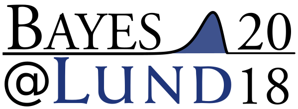

  
  <h2> 12th of April, 2018, Lund University</h2>

You are welcome to participate in the fifth edition of Bayes&#64;Lund! The purpose of this conference is to bring together researchers and professionals working with or interested in Bayesian methods. Bayes&#64;Lund aims at being **accessible** to researchers with little experience of Bayesian methods while still being **relevant** to experienced practitioners. The focus is on how Bayesian methods are used in research and in the industry, what advantages Bayesian methods have over classical alternatives, and how the use and teaching of Bayesian methods can be encouraged.

</img>

This conference will feature a number of contributed talks and short tutorials, and invited talks by [Paul-Christian Bürkner](https://paul-buerkner.github.io/) and [Jukka Ranta](https://www.evira.fi/en/about-evira/contact/personnel-search/r/jukka-ranta/). For what to expect, check out the programs from [past Bayes&#64;Lund events](https://bayesat.github.io/).

#### Invited speakers: Paul-Christian Bürkner and Jukka Ranta 

This year we are happy to announce that the first invited speaker is [Paul-Christian Bürkner](https://paul-buerkner.github.io/), researcher at the University of Münster, Department of Psychology. Paul is an expert in Bayesian statistical modeling, and is the creator of the well-known [BRMS software package](https://www.jstatsoft.org/article/view/v080i01) that makes it easy to do advanced Bayesian modeling.

We are equally happy to announce that the second invited speaker is [Jukka Ranta ](https://www.evira.fi/en/about-evira/contact/personnel-search/r/jukka-ranta/), professor at the Finnish Food Safety Authority, and docent of biometry from Helsinki University. Jukka's research is focused on Bayesian modeling for quantitative risk assessment in food safety applications. He has also taught several courses in Bayesian statistics at Helsinki University.

Call for Presentations and Short Tutorials
------------------------

As last year we invite you to submit a talk to Bayes&#64;Lund, but new for this year is that we also invite you to submit *short tutorials*.

**A talk** can be on any topic related to Bayesian methods including, but not restricted to:

- *Case studies*. Have you used Bayesian methods in your research? Describe what you did, and how it worked out.
- *Method development*. Are you developing novel Bayesian methods that you want to share?
- *Teaching Bayes*. Do you have experiences teaching Bayesian methods? What was the challenges, and do you have any useful tips?

Each accepted speaker is given 20 minutes and, as the audience will be highly heterogeneous, the talk is expected to be accessible and engaging for a multidisciplinary audience. 

**Short tutorials** are 10/20/30 minutes long tutorials where you introduce the audience to a  tool, package or methodology you find useful. It doesn't need to be something you've developed, just something you want to show the audience! 

To contribute a presentation or short tutorial for Bayes&#64Lund, please send in the title of your talk/tutorial with an abstract (no more than 100 words) to rasmus.baath@gmail.com. For a short tutorial, also indicate how much time you want (10/20/30 min.). The final date for submissions is **11th of February**. 

Conference registration
-----------------------

If you want to join us for Bayes&#64;Lund, please register your attendance using the form below. The final date of registration is __1st of April__. 

<iframe src="https://docs.google.com/forms/d/e/1FAIpQLSeObI_s4XhL0epYH9WZECNpdj_ueKZOpi7I0J9mgN7kzxSMwA/viewform?embedded=true" width="760" height="500" frameborder="0" marginheight="0" marginwidth="0">Loading...</iframe>

Important Dates
---------------
* Final date for presentations submission: __11th of February__
* Notifications to presenters: __18th of February__
* Final date for registration: __1st of April__
* The conference: __12th of April__

Location
---------------

[Lund University, Sweden](https://goo.gl/maps/Db9STE5QHcF2). The precise location is yet to be determined.

Program
-------------

The full program will be announced after the notifications to presenters have been sent out on the __18th of February__. Like last year the conference will run from 09:30 - 16:30 on the day of the event.

<!--

For the full program, including abstracts, see [the program booklet](http://www.lucs.lu.se/wp-content/uploads/2016/01/bayes_at_lund_2016_program.pdf).

-----------------------------------------------------------------
  &nbsp;      &nbsp;
  
------------- --------------------------------------------------
 11.45        Registration opens (just outside room LUX:C121)
 
 12.15-12.45  Welcome and invited presentation  
              - **_An Introduction to Bayesian computation and evidence synthesis using STAN_, [Robert Grant](http://www.robertgrantstats.co.uk/), Faculty of Health, Social Care and Education, University of London.** 
   
 12.45-13.15  Sandwich lunch and mingle in the foyer (free, but requires registration)
              
 13.15-14.15  Keynote presentation 
              - **_Bayesian Benefits for the Pragmatic Researcher_, [Eric-Jan Wagenmakers](http://www.ejwagenmakers.com/), Department of Psychology, University of Amsterdam.**
               
 14.20-15.10  Session 1  
              - **_Bayesian Meta Analysis and Bias Modeling: A Case Study with Relative Clause Processing in Mandarin Chinese_, [Shravan Vasishth](http://www.ling.uni-potsdam.de/~vasishth/) and Lena Jaeger, Departement of Linguistics, University of Potsdam.**   
              - **_A Bayesian reflection on the meaning of evidence_, [Ullrika Sahlin](http://evidence.blogg.lu.se/),  Centre for Environmental and Climate Research, Lund University.**  
              - **_The Bootstrap is a Bayesian procedure, but that doesn't mean it's any good_, [Rasmus Bååth](http://www.sumsar.net), Lund University Cognitive Science.**
 
 15.10-15.30  Coffee and cake

 15.30-16.30  Session 2  
              - **_Bayesian methods in epidemiological research – why so seldom used?_ [Jonas Björk](http://www.med.lu.se/labmedlund/amm/kontakt/jonas_bjoerk),  Division of occupational and environmental medicine, Lund University.** 
              - **_Regularized supervised topic models for high-dimensional multi-class regression_, [Måns Magnusson](https://twitter.com/MansMeg),  Department of Computer and Information Science, Linköping University.** 
              - **_Modeling the growth of Swedish Scots pines_, [Henrike Häbel](https://www.chalmers.se/en/staff/Pages/henrike-habel.aspx), Department of Mathematical Sciences, Chalmers University of Technology.**
              
 16.30          Concluding remarks and end of conference.
                   
------------- --------------------------------------------------

Pre-conference tutorial on Bayesian inference
-------------------------

The day before the conference there will be a tutorial seminar on Bayesian inference by Eric-Jan Wagenmakers, a great opportunity to learn or brush up the basics of Bayes! 

**Date?** Thursday 4th of February, 2016.

**Time?** 13:30 - 16:00, including break.

**Where?** Room B152 in the Lux building, Lund University. How to find it: http://www.ht.lu.se/en/lux/kontakt/kartor-och-fardsatt/

**What?** In the first part of the seminar, the principles of Bayesian parameter estimation and hypothesis testing will be illustrated with a concrete example. The second part of the seminar features a brief tour of [JASP](https://jasp-stats.org/), a software program that showcases the practical feasibility of the Bayesian agenda.

**How?** To sign up for the tutorial please use [the Conference registration form above](#conference-registration). Note that the number of spaces available on the tutorial is limited. 

-->

Contact
--------------
For more info, contact:

* *Rasmus Bååth*, Lund University Cognitive Science and DataCamp Inc: rasmus.baath@gmail.com
* *Ullrika Sahlin*, Lund University Centre of Environmental and Climate Research: ullrika.sahlin@cec.lu.se

Acknowledgement
----------------

We are deeply grateful to the [COMPUTE research school](http://cbbp.thep.lu.se/compute/index.php) for financial support of this event.

